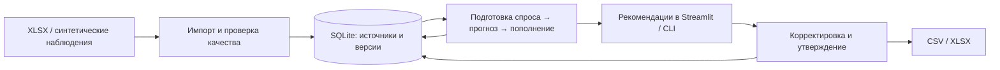

# Помощник закупщика — StockForge

Локальное приложение для расчёта пополнения склада и подготовки объяснимых заказов поставщикам. Разработано для кейса ТОО «Электрокомплект» на хакатоне HackAlem.

**Для кого:** менеджер отдела закупок, который объединяет отчёты и рассчитывает потребность вручную в Excel. Приложение связывает продажи, остатки, ожидаемые поступления и закупочные условия, показывает рекомендуемое количество и основания для него. Менеджер проверяет результат, корректирует и утверждает версию заказа.

**Текущая версия:** локальный MVP с русскоязычным интерфейсом и воспроизводимой синтетической демонстрацией. Реальные файлы импортируются и проверяются; подтверждённые реальные заказы на имеющемся наборе заблокированы до согласования недостающих данных и условий.

[Репозиторий](https://github.com/BAITC-Hacks/hack-3b47610b-blank) · [Демонстрация на 6 минут](DEMO.md) · [Отчёт приёмки](docs/ACCEPTANCE.md) · [Статус реализации](docs/STATUS.md)

## Что реализовано

| Возможность | Что получает пользователь |
|---|---|
| Импорт Systeme Electric и IEK | Загрузка шести XLSX-книг каждого поставщика, включая скрытые листы и встроенный архивный прайс IEK. Значения прослеживаются до файла, листа и ячейки. |
| Версии и проверки данных | Повторный импорт неизменённых файлов не дублирует данные; изменённый файл создаёт новую версию. Пустоты, нули, ошибки и расхождения источников показываются отдельно. |
| Подготовка регулярного спроса | Возвраты учитываются отдельно; разовые крупные сделки выделяются для проверки или исключения по заданному правилу. Повторные крупные покупки и устойчивый рост сохраняются. |
| Прогноз спроса | Месячный прогноз с сезонностью, трендом, обработкой прерывистого спроса и явными настройками бизнес-прироста. Модели сравниваются на прошлых временных периодах. |
| Упущенный спрос | Оценка потерь при подтверждённом полнодневном отсутствии товара. Коррекция входит в историю для прогноза и не превращается в текущую задолженность. |
| Пополнение и сценарии | Учёт доступного остатка, поступлений, сроков, политики категории, страхового запаса, единиц, MOQ и кратности. Проверка задержки поставки и изменения спроса. |
| Объяснения | Карточка товара с компонентами формулы, источниками, допущениями, прогнозом остатка и риском дефицита. |
| Работа с заказами | Проекты по поставщикам, корректировки с автором и причиной, проверка и утверждение. Утверждённая версия сохраняется; последующая правка создаёт новую. |
| Экспорт и воспроизводимость | Проверяемые CSV/XLSX, чтение расчётов по `run_id`, CLI, синтетическое демо и резервные копии SQLite. |

## Как работает решение

1. **Загрузить данные.** Импортировать отчёты поставщика либо открыть готовый синтетический набор.
2. **Проверить входы.** Изучить расхождения, выбрать источник продаж и задать закупочные параметры с автором, основанием и статусом подтверждения.
3. **Подготовить спрос.** Отделить регулярные продажи от возвратов и разовых сделок; при наличии доказательств учесть периоды отсутствия товара.
4. **Получить рекомендации.** Выбрать совместимые версии данных, подготовки и прогноза. Сохранить расчёт и проверить строки в карточках товаров.
5. **Проверить риск.** Посмотреть календарь остатка и при необходимости создать отдельный сценарий задержки или изменения спроса.
6. **Сформировать заказ.** Скорректировать количества, передать проект на проверку, утвердить и выгрузить CSV/XLSX.

В интерфейсе доступны пять разделов: **«Данные и проверки», «Рекомендации», «Карточка товара», «Сценарии», «Заказы»**.

### Расчёт и объяснение количества

Базовая потребность в единицах учёта:

```text
max(0, прогноз спроса за (L + R) + страховой запас
       − доступный остаток − своевременные ожидаемые поступления)
```

`L` — срок нового заказа, `R` — период пересмотра. Резерв уменьшает доступный остаток один раз; проектные обязательства учитываются отдельно от регулярного спроса. Потребность сначала переводится в единицу закупки, затем применяются MOQ (минимальная партия) и кратность. При нулевой потребности MOQ не создаёт заказ.

Например: `300 + 60 − 90 − 100 = 170`; кратность 12 даёт заказ **180**. Поздний приход не считается прибывшим. Если дефицит возникает раньше обычного нового заказа, приложение выделяет срочную проблему.

Текст обоснования создаётся из сохранённых компонентов расчёта. Полные правила: [пополнение](docs/REPLENISHMENT.md), [прогноз](docs/FORECASTING.md), [упущенный спрос](docs/LOST_DEMAND.md).

## Технологии и модели

| Компонент | Реализация |
|---|---|
| Язык | Python; в `pyproject.toml` указан диапазон `>=3.11,<3.15`. Проверенное окружение — Python 3.14.7. |
| Интерфейс | Streamlit: таблицы, формы, графики `st.line_chart`, скачивание файлов. |
| Excel | openpyxl; стандартные средства Python для чтения XML и встроенного кэша XLSX. |
| Хранилище | SQLite через стандартный модуль `sqlite3`: источники, параметры, расчёты, проекты заказов и журнал изменений. |
| Расчётное ядро | Собственный Python-код, не зависящий от Streamlit. |
| Проверки | pytest, Streamlit AppTest, синтетический эталон и проверки реальных книг при их наличии. |
| Окружение | uv, `pyproject.toml` и закреплённые зависимости в `uv.lock`. |

В зависимостях также объявлены pandas, NumPy и Plotly. Текущее расчётное ядро реализовано собственным кодом Python, а графики интерфейса строятся средствами Streamlit.

Прогноз выбирается из трёх статистических моделей:

- `seasonal_analog` — тот же календарный месяц прошлого года;
- `damped_level_trend` — сглаженный уровень и затухающий тренд;
- `intermittent_sba` — метод Croston с поправкой SBA для прерывистого спроса.

Проверка идёт последовательно по времени: модель учится на прошлом и прогнозирует следующий период. Отчёт содержит WAPE (относительную взвешенную ошибку), MAE (среднюю абсолютную ошибку), смещение и сравнение с простыми базовыми прогнозами. Неполный текущий месяц исключается из обучения.

**Внешние LLM, генеративные AI-модели и API-сервисы в приложении не используются.** API-ключи для запуска не нужны; после установки зависимостей расчёты выполняются локально.

## Архитектура проекта



Интерфейс и CLI обращаются к общему слою сервисов. Сервисы проверяют совместимость входных версий, вызывают расчётное ядро и сохраняют результат. Прогноз и пополнение не требуют запуска браузера.

| Путь | Назначение |
|---|---|
| `app.py`, `hackalem/ui/` | Точка входа и рабочее место закупщика. |
| `hackalem/__main__.py` | CLI для импорта, расчётов, отчётов, заказов, демо и резервных копий. |
| `hackalem/importers/` | Адаптеры форматов Systeme Electric и IEK. |
| `hackalem/services/` | Связь импорта, проверок, подготовки спроса, прогнозов, пополнения и заказов. |
| `hackalem/domain/` | Правила очистки, оценки потерь, прогнозирования и расчёта количества. |
| `hackalem/storage.py`, `hackalem/*_schema.py` | Создание и миграции SQLite, схемы данных. |
| `hackalem/config.py` | Пути источников и локального хранилища. |
| `hackalem/synthetic/` | Генератор наблюдений и спецификация проверочного набора. |
| `tests/`, `scripts/` | Тесты и воспроизводимые замеры реального/синтетического набора. |
| `docs/`, `DEMO.md` | Контракты данных, методология, результаты приёмки и сценарий защиты. |

## Установка и запуск

Команды ниже предназначены для **Windows PowerShell**. Нужны Git, Python 3.11–3.14 и uv. Git и uv должны быть доступны в терминале. Если uv ещё не установлен:

```powershell
py -m pip install --user uv
```

Откройте новый терминал после установки. На машине разработки проверены Python 3.14.7 и uv 0.12.13. При первой установке пакетов нужен интернет; Docker и отдельный сервер БД не требуются.

### 1. Получить проект и установить зависимости

```powershell
git clone https://github.com/BAITC-Hacks/hack-3b47610b-blank.git
Set-Location .\hack-3b47610b-blank
uv sync --locked
```

Если репозиторий уже открыт локально, перейдите в его корень и выполните только `uv sync --locked`. Все дальнейшие команды выполняются из корня проекта. Активировать виртуальное окружение и менять ExecutionPolicy не требуется.

### 2. Подготовить демонстрацию

Конфиденциальные файлы поставщиков для этого пути не нужны:

```powershell
uv run --locked python -m hackalem demo --output-root .local/demo
$demo = Get-Content -Raw -Encoding UTF8 '.local/demo/demo-v1-20260923/demo-manifest.json' | ConvertFrom-Json
$env:HACKALEM_DATA_DIR = Split-Path -Parent $demo.database_path
```

Команда создаёт отдельный набор из 17 вымышленных товаров двух поставщиков. Для выбранных примеров подготовлены 11 прогнозов, 3 расчёта пополнения, проекты заказов и 8 проверенных выгрузок. Срез демо фиксирован: **01.01.2026**, seed — `20260923`.

Манифест содержит пути, номера снимков, `run_id` и версии заказов. В папке `.local/demo/demo-v1-20260923/` находятся `reports/` с объяснениями и `exports/` с CSV/XLSX. Все демо-заказы имеют маркировку **`SYNTHETIC_SCENARIO`**.

Повторный вызов проверяет и использует готовый набор. Для новой демонстрации выберите другой `--output-root` и прочитайте манифест из него. Существующая незавершённая или повреждённая папка автоматически не перезаписывается.

### 3. Открыть приложение

```powershell
uv run --locked python -m streamlit run app.py
```

Откройте **http://127.0.0.1:8501**. Сервер слушает локальный адрес, сбор статистики Streamlit отключён. Для остановки нажмите `Ctrl+C`. Если порт занят:

```powershell
uv run --locked python -m streamlit run app.py --server.port 8502
```

В этом случае откройте http://127.0.0.1:8502.

### Запуск с реальными файлами

Поместите выданные организаторами книги в папки `IEK` и `Systeme electric` внутри отдельного каталога источников. Форматы ожидаемых шести книг каждого поставщика описаны в [контракте Systeme](docs/IMPORT_SYSTEME.md) и [контракте IEK](docs/IMPORT_IEK.md); произвольный Excel не является поддержанным форматом импорта.

После остановки демо задайте пути, заменив путь источников своим:

```powershell
$env:HACKALEM_SOURCE_DIR = 'C:\HackAlemData'
$env:HACKALEM_DATA_DIR = '.local/real'
uv run --locked python -m hackalem import-systeme
uv run --locked python -m hackalem import-iek
uv run --locked python -m hackalem list-snapshots
uv run --locked python -m streamlit run app.py
```

В интерфейсе импорт также доступен в разделе «Данные и проверки». Исходный сценарий реальных данных привязан к **22.09.2026**; дата компьютера его не заменяет. Без согласованных параметров приложение показывает причины недоступности расчёта. Параметры и выбор источников задаются через JSON по [контракту данных](docs/DATA_CONTRACT.md).

| Настройка | Значение по умолчанию |
|---|---|
| `HACKALEM_SOURCE_DIR` | Корень проекта с папками поставщиков. |
| `HACKALEM_DATA_DIR` | `.local`; БД — `hackalem.sqlite3` внутри выбранной папки. |
| `HACKALEM_REAL_SOURCE_DIR` | Путь к исходникам для тестов реальных книг; по умолчанию корень проекта. |

Относительные пути `HACKALEM_SOURCE_DIR` и `HACKALEM_DATA_DIR` разрешаются от корня проекта. Переменные действуют в текущем терминале; `.env` автоматически не читается. Хранилище нельзя размещать внутри папок поставщиков. Реальная и демонстрационная базы должны оставаться раздельными.

### Резервная копия и восстановление

`db-backup` копирует выбранную через `HACKALEM_DATA_DIR` базу с помощью SQLite Online Backup API, включая закоммиченные данные WAL. Команда не заменяет существующий файл:

```powershell
$backupPath = '.local/backups/hackalem-' + (Get-Date -Format 'yyyyMMdd-HHmmss') + '.sqlite3'
uv run --locked python -m hackalem db-backup --output $backupPath
```

Для восстановления остановите сервер, сохраните прежний путь базы и выберите новую пустую папку:

```powershell
$env:HACKALEM_DATA_DIR = '.local/restored'
uv run --locked python -m hackalem db-restore --input $backupPath
uv run --locked python -m hackalem list-snapshots
uv run --locked python -m streamlit run app.py
```

Если целевой файл уже существует, выберите другое имя папки. Храните резервную копию, исходники и версию кода с `uv.lock` на защищённом носителе. Для повторной проверки синтетического эталона нужна вся папка набора: `manifest.json`, `model/` и `validation/`, а не только БД.

## Как проверить решение жюри

После запуска демо выберите синтетический Dataset и дату **01.01.2026**. Номера версий берите из манифеста:

```powershell
$demo.snapshots | Format-Table
$demo.replenishment_run_ids
$demo.orders
```

Эти команды можно выполнить перед запуском сервера в том же терминале. Затем повторите сценарий в браузере:

| Шаг | Действие | Ожидаемый результат |
|---|---|---|
| 1. Обычный заказ | Выберите снимок Systeme Electric. В «Рекомендациях» и «Карточке товара» выберите сохранённый расчёт Systeme; откройте `SYN-A-001`. | Количество, единицы, компоненты формулы, источники и будущий остаток доступны для проверки. |
| 2. Сезонность и рост | В карточке выберите `SYN-A-002`, затем `SYN-A-003`. | Прогноз отражает сезонную форму и растущий спрос. |
| 3. Разовая сделка | Откройте `SYN-A-006`, график фактического/очищенного спроса и блок аномалий. | Разовая сделка 500 выделена из регулярной части. |
| 4. Отсутствие товара | Откройте `SYN-A-009`, блок наличия и упущенного спроса. Сравните `reports/stockout-raw-forecast.json` и `reports/forecast-SYN-A-009.json`. | В исторической проверке прогноз августа меняется с 119 до 217 при известном синтетическом спросе 217. |
| 5. Задержка | Переключитесь на снимок IEK, выберите `SYN-B-003`; сравните сохранённые расчёты `IEK` и `delay` из манифеста. | Задержка поступления на 14 дней вызывает срочный риск до прихода обычного нового заказа. |
| 6. Утверждение | В «Заказах» выберите подготовленный черновик. Укажите автора/причину передачи на проверку, затем ответственного/основание утверждения и подтвердите локальный характер записи имени. | Версия проходит `draft → review → approved`; предыдущий утверждённый снимок сохраняется. |
| 7. Экспорт | Отметьте «Выгрузить с этой маркировкой» и скачайте CSV или Excel. | Файл содержит поставщика, товары, количества, единицы и объяснения; маркировка — `SYNTHETIC_SCENARIO`. |

Для нового расчёта в «Рекомендациях» выберите совместимые качество, подготовку спроса и прогнозы товаров, затем нажмите «Рассчитать рекомендации». Смена даты или входной версии сбрасывает активный выбор старого результата; сохранённые расчёты остаются доступны для явного выбора.

Подробный сценарий защиты и команды проверки без UI — в [DEMO.md](DEMO.md). Например, после остановки сервера в том же терминале:

```powershell
uv run --locked python -m hackalem replenishment-report --run $demo.replenishment_run_ids.'Systeme Electric' --sku SYN-A-001
uv run --locked python -m hackalem order-report --version $demo.orders.IEK.approved_version_id
```

### Автоматические проверки

```powershell
uv run --locked python -m pytest -q
```

В [приёмке от 23.09.2026](docs/ACCEPTANCE.md) зафиксированы **156 прошедших тестов**, включая реальные книги обоих поставщиков. Без конфиденциальных исходников соответствующие тесты пропускаются. Проверяются импорт и версии, расчёты, пограничные случаи, сохранение утверждённых заказов, экспорт, восстановление БД и пользовательский сценарий через AppTest.

Для воспроизводимой проверки синтетической истории и замера времени:

```powershell
uv run --locked python -m scripts.benchmark_demo --output-dir .local/demo-validation
```

Выходная папка должна быть новой. В ней сохраняются `acceptance-history.json`, `benchmark.json` и профили. Скрытый истинный спрос читает только проверяющая процедура после работы модели. Тесты на синтетических данных не доказывают точность прогноза или экономию в реальном бизнесе.

## Данные и интеграции

**Реальные источники:** локальные XLSX-выгрузки Systeme Electric и IEK — история продаж, месячные показатели, остатки, поступления, категории и условия заказа. Для IEK читается встроенный архивный прайс; внешние связи Excel не обновляются. В зафиксированной приёмке обработаны 12 книг и 248 915 транзакционных строк. Структура и ограничения источников описаны в документах импорта.

**Демонстрационные данные:** воспроизводимые наблюдения за 2024–2025 годы для 17 вымышленных товаров. Набор включает стабильный, сезонный, растущий и прерывистый спрос, разовые сделки, возвраты, отсутствие товара, задержки и ограничения закупки.

**Интеграции:** файловый импорт XLSX и экспорт CSV/XLSX. Прямое подключение к 1С, ERP, API поставщиков и внешним AI-сервисам не реализовано. Совместимость выгрузки с конкретной конфигурацией 1С требует согласованного шаблона и пробного импорта.

Исходные PDF/XLSX не изменяются. Конфиденциальные книги, локальная БД, секреты и создаваемые выгрузки исключены из Git. Реальные данные во внешние сервисы приложение не отправляет; идентификаторы клиентов для анализа должны быть обезличены.

## Ограничения текущей версии

- **Не хватает подтверждённых реальных входов.** Среди них актуальный остаток IEK, дневное наличие товара, обезличенные клиенты, сроки поставки/пересмотра, политика категории, единицы и коэффициенты, действующие MOQ/кратности и полные даты поступлений. Архивные условия не считаются автоматически действующими.
- **Складской охват ограничен исходным отчётом.** Достоверное раздельное прогнозирование по складам не реализовано. Бизнес-параметры пока вводятся через JSON.
- **Есть явные допущения.** Страховой запас задаётся в днях; статистическая калибровка уровня обслуживания не заявлена. Месячный прогноз распределяется равномерно по дням, поэтому дата риска приблизительна. Если истории меньше 12 завершённых месяцев, нужен явно заданный прогноз по категории; без него прогноз не строится.
- **Выбросы и stockout требуют доказательств.** Без клиента/контекста крупная сделка остаётся кандидатом. Месячный остаток не определяет дни отсутствия; ручные интервалы дают только сценарную оценку.
- **Утверждение локальное.** Имя ответственного — запись в журнале, а не аутентификация или электронная подпись. Отправки заказов поставщикам нет.
- **Нет готовой промышленной интеграции.** Шаблон 1С и её импорт не прошли приёмку; облачное развёртывание не подготовлено. Экономия и точность на реальном спросе не доказаны.

## Развёрнутая версия

Публичный адрес работающего приложения **в текущем репозитории не указан**. Предусмотрен локальный запуск по инструкции выше. Адрес `http://127.0.0.1:8501` доступен на компьютере, где запущен Streamlit, и не является публичной демо-ссылкой.

## Дополнительная документация

| Документ | Содержание |
|---|---|
| [DEMO.md](DEMO.md) | Защита на 5–7 минут, ожидаемые примеры и проверка через CLI. |
| [SPEC.md](docs/SPEC.md), [STATUS.md](docs/STATUS.md) | Требования кейса и фактическое состояние реализации. |
| [ACCEPTANCE.md](docs/ACCEPTANCE.md) | Пять обязательных требований, результаты тестов, историческая проверка и замеры. |
| [DATA_CONTRACT.md](docs/DATA_CONTRACT.md) | Источники продаж, бизнес-параметры и правила готовности данных. |
| [SYNTHETIC_DATA.md](docs/SYNTHETIC_DATA.md) | Генератор, скрытый эталон и заранее заданные критерии. |
| [FORECASTING.md](docs/FORECASTING.md), [LOST_DEMAND.md](docs/LOST_DEMAND.md) | Методология прогноза и оценки упущенного спроса. |
| [REPLENISHMENT.md](docs/REPLENISHMENT.md), [ORDERS.md](docs/ORDERS.md) | Формула, воспроизводимость, корректировки, утверждение и экспорт. |
